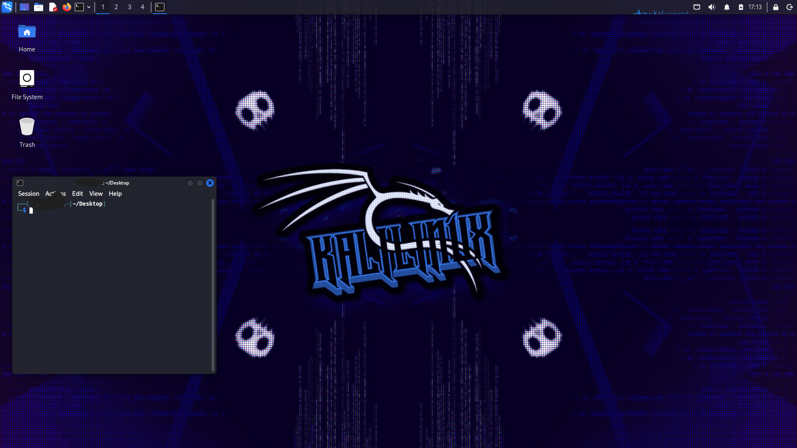
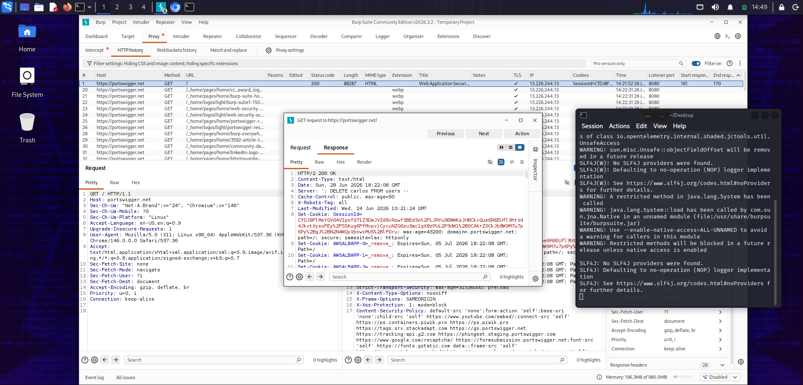
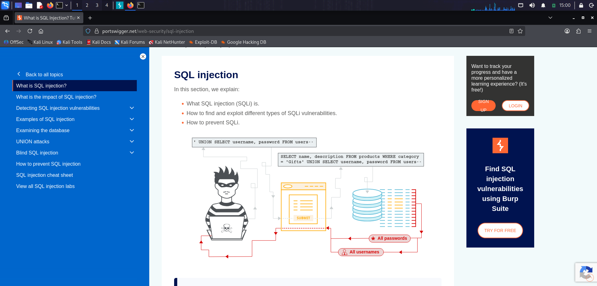

# CTF Training

<div align="center">



<br>



<br><br>


<br><br>

**A practical Cyber Security & CTF learning repository documenting my journey from Linux fundamentals to real-world Web Security testing.**

</div>

---

# About

This repository documents my personal journey through Cyber Security.

Every topic is learned from the ground up using practical laboratories, notes, experiments and real-world scenarios.

The objective is not to memorize payloads or copy write-ups.

Instead, I focus on understanding:

* How operating systems work.
* How networks communicate.
* How web applications process requests.
* How vulnerabilities are introduced.
* How security professionals identify and mitigate them.

Every markdown file represents one chapter of my learning process.

---

# Learning Roadmap

| Phase | Topic                              | Status |
| ----- | ---------------------------------- | ------ |
| 01    | Linux Fundamentals                 | ✅      |
| 02    | Networking Fundamentals            | ⏳      |
| 03    | HTTP Protocol                      | ✅      |
| 04    | Burp Suite                         | ✅      |
| 05    | Cookies & Sessions                 | ✅      |
| 06    | SQL Injection                      | ⏳      |
| 07    | Cross-Site Scripting (XSS)         | ⏳      |
| 08    | Authentication                     | ⏳      |
| 09    | Access Control (IDOR)              | ⏳      |
| 10    | File Upload Vulnerabilities        | ⏳      |
| 11    | Command Injection                  | ⏳      |
| 12    | Path Traversal                     | ⏳      |
| 13    | Server-Side Request Forgery (SSRF) | ⏳      |
| 14    | XML External Entity (XXE)          | ⏳      |
| 15    | Cross-Site Request Forgery (CSRF)  | ⏳      |
| 16    | JWT & OAuth                        | ⏳      |
| 17    | API Security                       | ⏳      |
| 18    | Enumeration (Nmap, ffuf, Gobuster) | ⏳      |
| 19    | Privilege Escalation               | ⏳      |
| 20    | CTF Practice                       | ⏳      |

---

# Repository Structure

```text
.
├── README.md
├── Linux.md
├── BurpSuite.md
└── Images/
    ├── kali-linux.png
    ├── burpsuite.png
    └── sql-injection.png
```

---

# Current Lab

<div align="center">

<a href="https://portswigger.net/web-security/sql-injection/lab-login-bypass">

</a>

</div>

Current Objective

**SQL Injection — Authentication Bypass**

This laboratory is part of the PortSwigger Web Security Academy and will be completed while documenting every concept, request, response and observation.

---

# Environment

| Component         | Version                          |
| ----------------- | -------------------------------- |
| Operating System  | Kali Linux                       |
| Virtualization    | VirtualBox                       |
| Browser           | Firefox                          |
| Proxy             | Burp Suite Community Edition     |
| Learning Platform | PortSwigger Web Security Academy |

---

# Learning Philosophy

This repository follows one simple principle:

> **Understand first. Exploit second. Memorize never.**

For every vulnerability I study:

* Learn the underlying theory.
* Observe the HTTP traffic.
* Understand why the vulnerability exists.
* Reproduce it in a controlled laboratory.
* Document the findings.

---

# Disclaimer

This repository is intended **strictly for educational purposes**.

All demonstrations, experiments and exercises are performed against intentionally vulnerable laboratories or authorized environments such as PortSwigger Web Security Academy.

No techniques documented here should be used against systems without explicit authorization.
